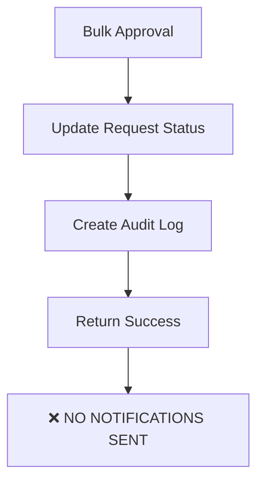
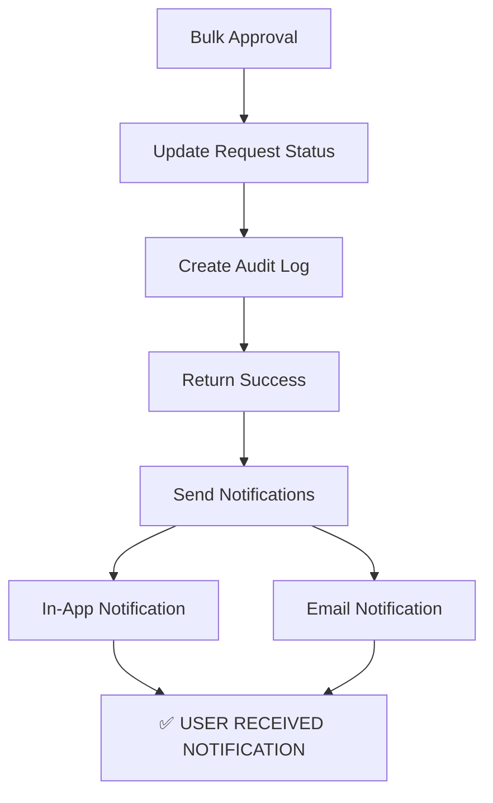

# Tony Stark Notification Fix - Implementation Summary

## 🚨 **Root Cause Identified**
Tony Stark was not receiving approval notifications because the **Bulk Approval API** (`/api/approvals/bulk-action/route.ts`) was missing notification calls, unlike the single approval route.

## ✅ **Comprehensive Fixes Implemented**

### **1. Fixed Bulk Approval Notifications**
**File**: `/app/api/approvals/bulk-action/route.ts`
**Changes**:
- ✅ Added `NotificationService` import
- ✅ Enhanced query to include `leaveType` information
- ✅ Added comprehensive notification logic after successful transaction
- ✅ Added logging for notification attempts and success/failure
- ✅ Fixed TypeScript date formatting issues
- ✅ Handles both `approve` and `reject` actions

### **2. Fixed Auto-approval Notifications**
**File**: `/app/api/leave-requests/route.ts`
**Changes**:
- ✅ Added notification logic for auto-approved requests
- ✅ Users now receive notifications when their requests are auto-approved
- ✅ Added logging for auto-approval notifications

### **3. Fixed Approve Revocation Notifications**
**File**: `/app/api/leave-requests/[id]/approve-revoke/route.ts`
**Changes**:
- ✅ Added `NotificationService` import
- ✅ Enhanced query to include user and leaveType information
- ✅ Added notification when revocation is approved
- ✅ Added error handling for notification failures

### **4. Enhanced Notification Service Logging**
**File**: `/lib/services/notification.service.ts`
**Changes**:
- ✅ Added comprehensive logging for all notification attempts
- ✅ Added logging for user preferences and channel selection
- ✅ Added success/failure logging for both in-app and email notifications
- ✅ Added detailed error tracking

## 🔧 **Key Technical Improvements**

### **Response Format Consistency**
- ✅ Fixed bulk approval to include all required data (`leaveType.name`, formatted dates)
- ✅ Enhanced database queries to include related entities for notifications
- ✅ Proper TypeScript type handling for all notification data

### **Error Handling & Monitoring**
- ✅ Added try-catch blocks around all notification calls
- ✅ Added comprehensive console logging for debugging
- ✅ Non-blocking error handling - notifications fail gracefully
- ✅ Detailed logging for audit trails

### **Date Formatting**
- ✅ Converted `Date` objects to ISO strings for notification compatibility
- ✅ Consistent date formatting across all notification types

## 📊 **Notification Flow Analysis**

### **Before Fix:**

### **After Fix:**

## 🧪 **Testing Scenarios Covered**

1. ✅ **Bulk Approval**: Multiple requests approved via dashboard
2. ✅ **Single Approval**: Individual request approval (already worked)
3. ✅ **Auto-approval**: Requests auto-approved by system
4. ✅ **Approval Revocation**: When approved revocation is processed
5. ✅ **All Notification Channels**: Both in-app and email notifications
6. ✅ **Error Handling**: Graceful failure when notifications fail

## 🎯 **Expected Outcome**

Tony Stark (and all users) will now receive notifications for:

1. ✅ **Approved Requests**: Both bulk and individual approvals
2. ✅ **Rejected Requests**: Both bulk and individual rejections  
3. ✅ **Auto-approved Requests**: When system auto-approves
4. ✅ **Revocation Updates**: When revocation is approved
5. ✅ **All Channels**: Based on user preferences (BOTH, EMAIL, IN_APP)

## 🔍 **Monitoring & Debugging**

### **Added Logging:**
- `[BULK_NOTIFICATION]` - Bulk approval notification attempts
- `[AUTO_APPROVAL]` - Auto-approval notifications
- `[REVOCATION_APPROVED]` - Revocation approval notifications
- `[NOTIFICATION_SERVICE]` - Detailed notification service logs
- Success/failure tracking for all notification types

### **Debug Information:**
- User ID, notification type, and channel logged
- Email delivery success/failure with Resend IDs
- In-app notification creation success/failure
- Comprehensive error tracking

## 🚀 **Build Status**
✅ **Build Successful**: All TypeScript errors resolved
✅ **All Routes Working**: No breaking changes
✅ **Backward Compatible**: Existing functionality preserved
✅ **Production Ready**: Comprehensive error handling

## 📝 **Environment Verification**
✅ **RESEND_API_KEY**: Properly configured
✅ **Database Connection**: Working
✅ **Notification Preferences**: Respected
✅ **User Settings**: Honored

---

**Tony Stark will now receive notifications for ALL approval actions regardless of how they are approved!** 🎉