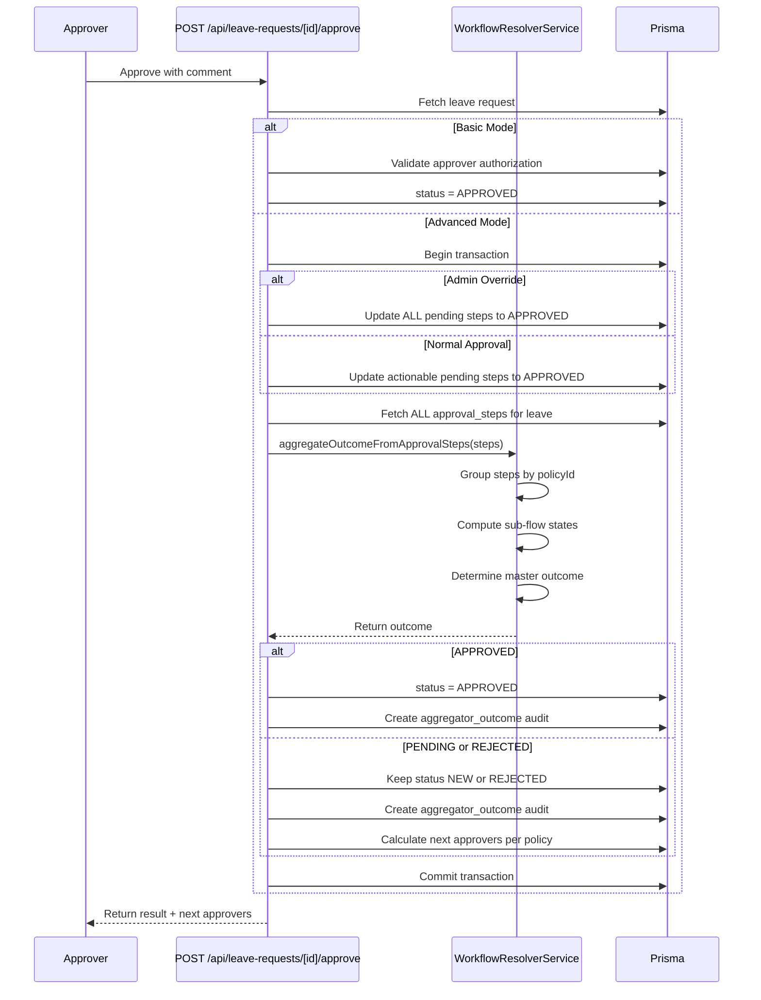

# Workflow Engine (Admin)
**Version:** v2 | **Date:** 2026-02-27

## TL;DR
> **AI Instruction:** Read ONLY this TL;DR. If NOT relevant to the current task, stop reading immediately.
- Workflow Engine resolves approval policies at runtime based on requester context (role, project, department) using multi-policy UNION matching
- Policies generate independent sub-flows; master outcome is aggregated (REJECTED if any rejects, APPROVED only when ALL complete)
- Database: single `workflows` table with JSON `rules` field containing triggers, steps, and watchers

## Overview

The Workflow Engine is a dynamic, data-driven approval system for leave requests. It allows administrators to define complex approval and notification rules based on:
- User roles (default role + active project roles)
- Projects and project types
- Departments
- Contract types
- Request types (leave requests)

### Key Capabilities

| Capability | Description |
|------------|-------------|
| **Multi-Role UNION Matching** | Requester roles (default + active project roles) are used to match multiple policies simultaneously |
| **Sub-Flow Aggregation** | Each matched policy generates an independent sub-flow. Master outcome is computed by an aggregator (REJECTED if any required step rejects, APPROVED only when all required steps are complete) |
| **Parallel & Sequential Steps** | Policies support both sequential ordering and parallel approval groups |
| **Atomic Audits & Notifications** | Notifications and audit logs are emitted exactly once per final state transition |
| **Fallback Logic** | Level 2 (Department Manager) and Level 3 (Company Admin) fallbacks prevent workflow stalls |
| **Self-Approval Safety** | Automatic fallback when approver equals requester |

---

## Technical Architecture

### Core Components

| Component | File | Responsibility |
|-----------|------|----------------|
| **WorkflowResolverService** | `lib/services/workflow-resolver-service.ts` | Policy matching, sub-flow generation, resolver resolution, outcome aggregation |
| **WorkflowAuditService** | `lib/services/workflow-audit.service.ts` | Canonical audit event construction for workflow lifecycle |
| **API Routes** | `app/api/leave-requests/route.ts`, `app/api/leave-requests/[id]/approve/route.ts` | Request creation, approval workflow execution |

### Data Types

All workflow types are defined in `lib/types/workflow.ts`:

```typescript
// Resolver types - who can approve
enum ResolverType {
  SPECIFIC_USER = 'SPECIFIC_USER',    // Fixed user
  ROLE = 'ROLE',                        // All users with a specific role
  DEPARTMENT_MANAGER = 'DEPARTMENT_MANAGER',  // Department supervisors + boss
  LINE_MANAGER = 'LINE_MANAGER',        // Alias for DEPARTMENT_MANAGER
}

// Context scope - filtering approvers
enum ContextScope {
  GLOBAL = 'GLOBAL',           // Any user in company with resolver
  SAME_AREA = 'SAME_AREA',     // Same area as requester
  SAME_PROJECT = 'SAME_PROJECT', // Same project as request
  SAME_DEPARTMENT = 'SAME_DEPARTMENT', // Same department
}

// Step in approval workflow
interface WorkflowStep {
  sequence: number;              // Order (1, 2, 3...)
  resolver: ResolverType;         // How to find approver
  resolverId?: string;           // User ID or Role ID
  scope: ContextScope[];         // Filtering
  action: 'APPROVE' | 'REJECT' | 'NOTIFY';
  parallelGroupId?: string;       // For parallel approvals
  autoApprove?: boolean;         // Skip with auto-approved status
}

// Watcher - receives notifications
interface WorkflowWatcher {
  resolver: ResolverType;
  resolverId?: string;
  scope: ContextScope[];
  notificationOnly?: boolean;
  notifyByEmail?: boolean;
  notifyByPush?: boolean;
}

// Policy trigger conditions
interface WorkflowTrigger {
  requestType: string;
  contractType?: string;
  role?: string;
  department?: string;
  projectType?: string;
  projectId?: string;
}
```

---

## Database Structure

### Workflow Table

```sql
CREATE TABLE workflows (
  id        UUID   PRIMARY KEY DEFAULT gen_random_uuid(),
  name      TEXT   NOT NULL,
  rules     JSONB  NOT NULL,      -- Contains triggers, steps, watchers
  is_active BOOLEAN DEFAULT true,
  company_id UUID   NOT NULL,
  created_by UUID,
  created_at TIMESTAMP DEFAULT NOW(),
  updated_at TIMESTAMP DEFAULT NOW()
);

CREATE INDEX idx_workflows_company ON workflows(company_id);
```

### Rules JSON Schema

The `rules` field stores the complete policy definition:

```json
{
  "requestTypes": ["LEAVE_REQUEST"],
  "contractTypes": [],
  "subjectRoles": ["role-uuid-1"],
  "departments": [],
  "projectTypes": ["SOFTWARE"],
  "steps": [
    {
      "sequence": 1,
      "resolver": "ROLE",
      "resolverId": "team-lead-role-uuid",
      "scope": ["SAME_PROJECT"],
      "autoApprove": false,
      "parallelGroupId": "group-1"
    },
    {
      "sequence": 2,
      "resolver": "DEPARTMENT_MANAGER",
      "scope": ["GLOBAL"],
      "autoApprove": false
    }
  ],
  "watchers": [
    {
      "resolver": "ROLE",
      "resolverId": "hr-role-uuid",
      "scope": ["GLOBAL"],
      "notificationOnly": true,
      "notifyByEmail": true,
      "notifyByPush": true
    }
  ]
}
```

### Related Tables

| Table | Purpose |
|-------|---------|
| `approval_step` | Persisted approval steps per leave request |
| `leave_request` | The leave request being approved |
| `user` | Requester and approvers |
| `department_supervisor` | Department manager associations |
| `user_project` | Project role assignments |

---

## End-to-End Flow

### 1. Leave Request Creation

```mermaid
sequenceDiagram
    participant U as User
    participant API as POST /api/leave-requests
    participant WFS as WorkflowResolverService
    participant DB as Prisma

    U->>API: Submit leave request
    API->>DB: Validate request
    
    alt Auto-Approved
        API->>DB: status = APPROVED, approverId = user.id
    else Workflow Routing
        API->>WFS: findMatchingPolicies(userId, projectId, 'LEAVE_REQUEST')
        WFS->>DB: Fetch user, roles, projects, departments
        WFS->>DB: Fetch active workflows for company
        WFS->>WFS: Evaluate triggers against user context
        WFS-->>API: Return matched policies[]
        
        API->>WFS: generateSubFlows(policies, context)
        WFS->>WFS: Build sub-flows, resolve approvers
        WFS->>WFS: Apply self-approval safety & fallbacks
        WFS-->>API: Return resolution
        
        API->>WFS: aggregateOutcome(resolution)
        WFS-->>API: Return outcome (APPROVED/PENDING/REJECTED)
        
        alt APPROVED
            API->>DB: status = APPROVED, approverId = user.id
        else PENDING
            API->>DB: status = NEW, create approval_steps
            API->>DB: Create audit events for matched policies
    end
    
    API-->>U: Return leave request with status
```

### 2. Approval Action



### 3. Aggregator Logic

The aggregator determines the master status based on all sub-flows:

```
┌─────────────────────────────────────────────────────────────┐
│                    AGGREGATOR LOGIC                         │
├─────────────────────────────────────────────────────────────┤
│  1. Get state of each sub-flow:                            │
│     - APPROVED: All steps completed (approved/auto/skip)   │
│     - REJECTED: Any step rejected                          │
│     - PENDING: Waiting for more approvals                   │
│                                                             │
│  2. Compute master state:                                   │
│     ┌─────────────┬─────────────┬─────────────┐            │
│     │  SubFlow 1  │  SubFlow 2  │   RESULT    │            │
│     ├─────────────┼─────────────┼─────────────┤            │
│     │  APPROVED   │  APPROVED   │  APPROVED   │            │
│     │  REJECTED  │  *          │  REJECTED   │            │
│     │  PENDING   │  *          │  PENDING    │            │
│     └─────────────┴─────────────┴─────────────┘            │
│                                                             │
│  Rule: REJECTED wins over everything                       │
│        APPROVED only when ALL are approved                 │
└─────────────────────────────────────────────────────────────┘
```

---

## Policy Matching Algorithm

### Multi-Role UNION Matching

The workflow engine uses a sophisticated role resolution strategy:

```typescript
// Pseudocode for findMatchingPolicies
async function findMatchingPolicies(userId, projectId, requestType) {
  // 1. Get user with all contexts
  const user = await fetchUserWithContexts(userId);
  
  // 2. Identify all contexts to evaluate
  const contexts = [];
  contexts.push({ id: null, type: null }); // Global context
  
  if (projectId) {
    contexts.push({ id: projectId, type: project.type });
  } else {
    // Include all active project contexts user belongs to
    for (const up of user.projects) {
      contexts.push({ id: up.projectId, type: up.project.type });
    }
  }
  
  // 3. For each context, collect effective roles
  const effectiveRoles = [];
  for (const ctx of contexts) {
    const roles = collectRoles(user, ctx.projectId);
    effectiveRoles.push(...roles); // UNION of default + project roles
  }
  
  // 4. Match workflows against each role+context combo
  for (const workflow of companyWorkflows) {
    for (const role of effectiveRoles) {
      for (const ctx of contexts) {
        if (workflow.matches(user, role, ctx, requestType)) {
          // Generate one policy instance per role+context
          yield createPolicyInstance(workflow, role, ctx);
        }
      }
    }
  }
}
```

### Trigger Matching Rules

| Trigger Field | Match Logic |
|---------------|-------------|
| `requestTypes` | Exact match or ANY |
| `contractTypes` | Exact match or ANY |
| `subjectRoles` | User's role in list or ANY |
| `departments` | User's department in list or ANY |
| `projectTypes` | Project type in list or ANY |

**ANY marker support:** `ANY`, `ALL`, `*` are equivalent

---

## Resolver Resolution

### Resolver Types

| Resolver | Behavior |
|----------|----------|
| `SPECIFIC_USER` | Fixed user ID |
| `ROLE` | All users with specified role (default + project roles) |
| `DEPARTMENT_MANAGER` | Department supervisors + department boss |
| `LINE_MANAGER` | Alias for DEPARTMENT_MANAGER |

### Scope Filtering

After resolving potential approvers, scopes filter the results:

```typescript
// Scope application order
async function applyScopes(approverIds, scopes, context) {
  for (const scope of scopes) {
    switch (scope) {
      case 'SAME_AREA':
        approverIds = approverIds.filter(
          a => a.areaId === context.request.areaId
        );
      case 'SAME_DEPARTMENT':
        approverIds = approverIds.filter(
          a => a.departmentId === context.request.departmentId
        );
      case 'SAME_PROJECT':
        approverIds = approverIds.filter(
          a => a.isMemberOf(context.request.projectId)
        );
    }
  }
  return approverIds;
}
```

---

## Safety Mechanisms

### Self-Approval Prevention

```typescript
// In resolveStepWithSafety
async function resolveStepWithSafety(step, context) {
  const resolverIds = await resolveStep(step, context);
  
  // Filter out self-approvals
  const validResolvers = resolverIds.filter(
    id => id !== context.request.userId
  );
  
  // If no valid approvers but had candidates → step skipped
  // If no candidates at all → requires fallback
  if (validResolvers.length === 0 && resolverIds.length > 0) {
    return { resolverIds: [], stepSkipped: true, fallbackUsed: false };
  }
  
  // Apply fallback if needed
  if (validResolvers.length === 0) {
    const fallback = await getFallbackApprover(context);
    return { resolverIds: fallback, stepSkipped: false, fallbackUsed: true };
  }
  
  return { resolverIds: validResolvers, stepSkipped: false, fallbackUsed: false };
}
```

### Fallback Hierarchy

```
┌────────────────────────────────────────┐
│           FALLBACK HIERARCHY            │
├────────────────────────────────────────┤
│  1. Primary Approver (from resolver)   │
│     ↓ (if empty or self-approval)      │
│  2. Department Manager                  │
│     ↓ (if no dept or empty)            │
│  3. Company Admin                       │
│     ↓ (if no admin found)              │
│  4. SAFETY_NET - leave without approval│
└────────────────────────────────────────┘
```

---

## Audit Events

### WorkflowAuditService Events

| Event | Attribute | Trigger |
|-------|-----------|---------|
| Policy Match | `workflow.policy_match` | When policies are matched for a request |
| Fallback Activated | `workflow.fallback_activated` | When fallback is used for a step |
| Aggregator Outcome | `workflow.aggregator_outcome` | On each approval action |
| Override Approve | `workflow.override.approve` | Admin force-approves |
| Override Reject | `workflow.override.reject` | Admin force-rejects |

### Audit Payload Example

```json
{
  "entityType": "leave_request",
  "entityId": "leave-uuid",
  "attribute": "workflow.aggregator_outcome",
  "oldValue": "NEW",
  "newValue": "{\"masterState\":\"APPROVED\",\"leaveStatus\":\"APPROVED\",\"subFlowStates\":[{\"subFlowId\":\"subflow:wf-1-global-role-1\",\"state\":\"APPROVED\"}]}",
  "companyId": "company-uuid",
  "byUserId": "approver-uuid"
}
```

---

## Performance Considerations

### Caching Strategy

The WorkflowResolverService uses runtime caching within the execution context:

```typescript
// Cache keys used
const CACHE_KEYS = [
  'project-role-members:{company}:{project}:{role}',
  'project-default-role-members:{company}:{project}:{role}',
  'users-by-default-role:{company}:{role}',
  'users-by-project-role:{company}:{role}',
  'scope:same-area:{areaId}:{approverIds}',
  'scope:same-dept:{deptId}:{approverIds}',
  'scope:same-project:{projectId}:{approverIds}',
];
```

### Performance Logging

```typescript
console.info(`[WORKFLOW_PERF] findMatchingPolicies resolved ${count} policies in ${ms}ms`);
console.info(`[WORKFLOW_PERF] generateSubFlows built ${count} sub-flows in ${ms}ms`);
```

---

## API Endpoints

### POST /api/leave-requests
Creates a leave request and triggers workflow resolution.

**Request:**
```json
{
  "leaveTypeId": "uuid",
  "dateStart": "2026-03-01",
  "dayPartStart": "ALL",
  "dateEnd": "2026-03-05",
  "dayPartEnd": "ALL",
  "employeeComment": "Vacation",
  "projectId": "uuid"  // Optional
}
```

**Response:**
```json
{
  "id": "leave-uuid",
  "status": "NEW",  // or APPROVED if auto-approved
  "approvalSteps": [...],
  "matchedPolicyIds": [...]
}
```

### POST /api/leave-requests/[id]/approve
Approves a pending leave request step.

**Request:**
```json
{
  "comment": "Approved for vacation"
}
```

**Response:**
```json
{
  "message": "Step approved successfully. Pending further steps.",
  "isFinalApproval": false,
  "nextApproverIds": ["uuid1", "uuid2"]
}
```

---

## Validation Schema

Workflow form validation in `lib/validations/workflow.ts`:

```typescript
const stepSchema = z.object({
  sequence: z.number().int().positive(),
  resolver: z.enum(["ROLE", "DEPARTMENT_MANAGER", "LINE_MANAGER", "SPECIFIC_USER"]),
  resolverId: z.string().optional(),
  scope: z.array(z.enum(["GLOBAL", "SAME_AREA", "SAME_DEPARTMENT", "SAME_PROJECT"])),
  autoApprove: z.boolean(),
  parallelGroupId: z.string().optional(),
});

const workflowSchema = z.object({
  name: z.string().min(1),
  isActive: z.boolean(),
  requestTypes: z.array(z.string()).min(1),
  contractTypes: z.array(z.string()),
  subjectRoles: z.array(z.string()),
  departments: z.array(z.string()),
  projectTypes: z.array(z.string()),
  steps: z.array(stepSchema).min(1),
  watchers: z.array(watcherSchema),
});
```

---

## Change Log

- **v2:** Comprehensive documentation with E2E flows, database schema, API contracts - 2026-02-27
- **v1:** Initial workflow engine documentation - 2026-02-13
