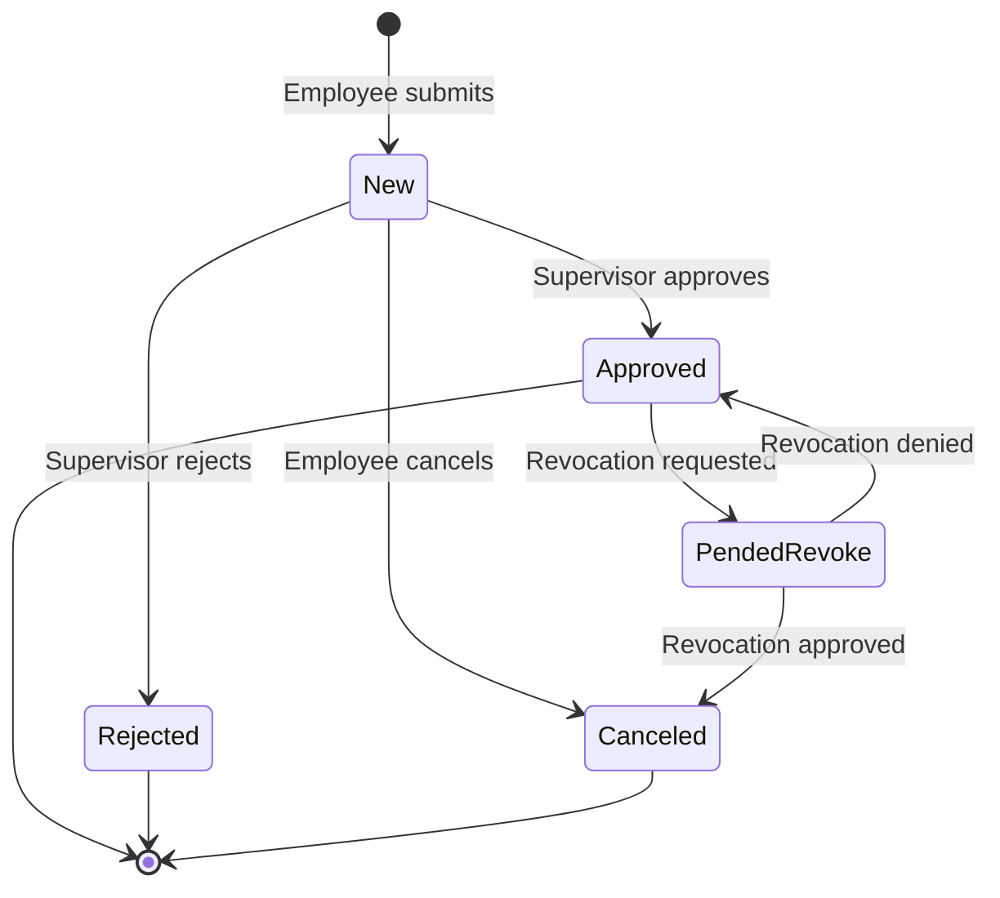

# PRD 04: Leave Request Workflow

**Document Version:** 1.0  
**Date:** January 9, 2026  
**Status:** Draft  
**Author:** Senior Product Manager

---

## Executive Summary

This document defines the complete leave request workflow for TimeOff Management Application v2, covering the end-to-end process from employee submission through supervisor approval/rejection. This is the core operational feature of the application.

### Business Context

The leave request workflow is the primary user interaction in the system. Employees submit time-off requests, which are routed to appropriate approvers based on organizational structure and approval rules. The workflow must handle:

- Simple supervisor-based approvals (basic mode)
- Complex multi-role approval chains (advanced mode)
- Overlap detection and conflict prevention
- Half-day and multi-day requests
- Request cancellation and revocation
- Complete audit trail

### Goals and Objectives

1. **Streamlined Submission**: Intuitive request form with real-time validation
2. **Intelligent Routing**: Automatic routing to correct approvers based on department/project/role
3. **Conflict Prevention**: Detect overlaps and allowance issues before submission
4. **Transparent Status**: Clear visibility into request status and approval progress
5. **Flexible Workflows**: Support both simple and complex approval chains
6. **Complete Audit Trail**: Track all actions and decisions

### Success Criteria

- ✅ All v1 workflow features migrated
- ✅ Request submission completes in <3 seconds
- ✅ Zero data loss during approval process
- ✅ Accurate allowance calculations
- ✅ Proper routing in 100% of cases
- ✅ Mobile-responsive request form

---

## 1. Feature Overview

### 1.1 Workflow Modes

The system supports two workflow modes based on company configuration:

**Basic Mode** (`companies.mode = 1`)
- Simple department-based approval
- Requests route to department supervisors
- Single approval step
- Fallback to admin if no supervisor assigned

**Advanced Mode** (`companies.mode != 1`)
- **Role & Project Routing**: Approval chains based on user roles (e.g., Developer, PM) and project context.
- **Project-Specific Logic**: Differentiation between `Project` (TL + PM) and `Staff Augmentation` (PM only) workflows.
- **Area-Based Matching**: Tech Leads matched to developers via technical areas (FE, BE, etc.).
- **Multi-Step Chains**: Support for both parallel and sequential approval steps.
- **Department Manager Fallback**: Triggered only if no project-based rules are matched.

### 1.2 Request Lifecycle



### 1.3 Key Components

1. **Request Submission Form**
2. **Validation Engine**
3. **Approval Routing Logic**
4. **Approver Dashboard**
5. **Request Status Tracking**
6. **Cancellation/Revocation Handling**
7. **Audit Trail**

---

## 2. Detailed Requirements

### 2.1 Leave Request Submission

#### 2.1.1 Request Form Fields

**Required Fields:**
- **Leave Type** (dropdown)
  - Source: `leave_types` table filtered by `company_id`
  - Only show active leave types (`deleted_at IS NULL`)
  - Sorted by `sort_order`
  
- **Start Date** (date picker)
  - Cannot be in the past (except for admins)
  - Must be a working day (check user/company schedule)
  
- **Start Day Part** (radio buttons)
  - Options: All Day, Morning Only, Afternoon Only
  - Default: All Day
  
- **End Date** (date picker)
  - Must be >= start date
  - Must be a working day
  
- **End Day Part** (radio buttons)
  - Options: All Day, Morning Only, Afternoon Only
  - Default: All Day
  - If start_date = end_date and start_day_part = 'morning', only allow 'morning' or 'all'
  - If start_date = end_date and start_day_part = 'afternoon', only allow 'afternoon'

**Optional Fields:**
- **Employee Comment** (textarea, max 255 characters)
  - Reason for leave or additional context

**Calculated/Display Fields:**
- **Days Deducted** (read-only, calculated)
  - Shows how many days will be deducted from allowance
  - Only shown if leave type `use_allowance = true`
  - Calculation accounts for:
    - Working days only (exclude weekends per schedule)
    - Public holidays (exclude if `department.include_public_holidays = true`)
    - Half days (0.5 deduction)
    
- **Remaining Allowance** (read-only)
  - Current allowance minus pending/approved requests minus this request
  - Warning if would go negative (unless admin override)

#### 2.1.2 Form Validation Rules

**Client-Side Validation:**
1. All required fields must be filled
2. End date >= start date
3. Day part combinations must be logical
4. Employee comment <= 255 characters

**Server-Side Validation:**
1. **Date Range Validation**
   - Start and end dates must be valid dates
   - End date >= start date
   - Dates cannot be more than 2 years in the future
   
2. **Working Day Validation**
   - Check against user's schedule (or company schedule if no user schedule)
   - At least one working day must be included in range
   
3. **Overlap Detection**
   - Query existing requests for same user
   - Check for any date overlap (including half-day conflicts)
   - Rules:
     - Cannot overlap with approved requests
     - Cannot overlap with pending requests
     - Can overlap with rejected/canceled requests
   - Half-day logic:
     - Same day, both "all day" = conflict
     - Same day, one "morning" and one "afternoon" = no conflict
     - Same day, both "morning" or both "afternoon" = conflict
     
4. **Allowance Validation** (if `leave_type.use_allowance = true`)
   - Calculate total allowance for year
   - Calculate days already used (approved requests)
   - Calculate days pending (pending requests)
   - Ensure: `remaining_allowance - days_requested >= 0`
   - Exception: Admins can override, or if `user.is_auto_approve = true`
   
5. **Leave Type Limit Validation** (if `leave_type.limit IS NOT NULL`)
   - Count days used for this specific leave type in current year
   - Ensure: `days_used + days_requested <= leave_type.limit`
   
6. **User Status Validation**
   - User must be activated (`users.activated = true`)
   - User must not be deleted (`users.deleted_at IS NULL`)
   - User's company must exist and be active

#### 2.1.3 Request Submission Process

**Step 1: Form Submission**
```typescript
POST /api/leave-requests

Request Body:
{
  leave_type_id: UUID,
  date_start: Date,
  day_part_start: 'all' | 'morning' | 'afternoon',
  date_end: Date,
  day_part_end: 'all' | 'morning' | 'afternoon',
  employee_comment?: string
}
```

**Step 2: Validation**
- Run all server-side validations
- Return 400 with specific error messages if validation fails

**Step 3: Auto-Approval Check**
```typescript
// Auto-approve if:
if (user.is_auto_approve || leave_type.auto_approve || user.contract_type === 'Contractor') {
  status = 'approved'
  approver_id = user.id // Self-approved or system approved
  decided_at = NOW()
  
  // Note: Contractors are auto-approved but notifications are still sent
  // as per PRD "Communication/Information event" requirement.
} else {
  status = 'new'
  approver_id = null
  decided_at = null
}
```

**Step 4: Create Leave Request**
```sql
INSERT INTO leave_requests (
  user_id,
  leave_type_id,
  date_start,
  day_part_start,
  date_end,
  day_part_end,
  status,
  employee_comment,
  approver_id,
  decided_at
) VALUES (...)
```

**Step 5: Determine Approvers (if not auto-approved)**
- Run approval routing logic (see section 2.3)
- Create approval steps if advanced mode

**Step 6: Send Notifications**
- Notify approver(s) of pending request
- Notify watchers (if watcher rules match)
- Send confirmation to employee

**Step 7: Return Response**
```typescript
Response 201:
{
  id: UUID,
  status: 'new' | 'approved',
  days_deducted: number,
  approvers: User[], // Who needs to approve
  message: string
}
```

---

### 2.2 Approval Routing Logic

#### 2.2.1 Basic Mode Routing

**Algorithm:**
```typescript
function getApproversBasicMode(userId: UUID): User[] {
  // 1. Get user's department
  const user = getUserWithDepartment(userId)
  
  if (!user.department_id) {
    // No department: route to company admins
    return getCompanyAdmins(user.company_id)
  }
  
  // 2. Get department supervisors
  const supervisors = query(`
    SELECT u.* FROM users u
    JOIN department_supervisor ds ON ds.user_id = u.id
    WHERE ds.department_id = $1
    AND u.activated = true
    AND u.deleted_at IS NULL
  `, [user.department_id])
  
  // 3. Exclude self (cannot approve own request)
  supervisors = supervisors.filter(s => s.id !== userId)
  
  if (supervisors.length > 0) {
    return supervisors
  }
  
  // 4. Fallback: check legacy boss_id
  const department = getDepartment(user.department_id)
  if (department.boss_id && department.boss_id !== userId) {
    const boss = getUser(department.boss_id)
    if (boss.activated && !boss.deleted_at) {
      return [boss]
    }
  }
  
  // 5. Final fallback: company admins
  return getCompanyAdmins(user.company_id)
}
```

**Characteristics:**
- Single approval step
- All returned approvers can approve (any one approval is sufficient)
- Request is stored with `approver_id = null` until approved
- No `approval_steps` records created

#### 2.2.2 Advanced Mode Routing

**Algorithm:**
```typescript
function getApproversAdvancedMode(userId: UUID, leaveRequest: LeaveRequest): ApprovalStep[] {
  const user = getUserWithRolesAndAreas(userId)
  
  // 1. Resolve Project Context
  // Context MUST be explicitly resolved (usually via UI selection or current active project)
  const contextProject = getProjectForRequest(leaveRequest.project_id)
  
  if (!contextProject) {
    // No project: fallback to department manager
    return createDepartmentManagerApproval(user.department_id, userId)
  }

  // 2. Retrieve All Matching Approval Rules
  const rules = query(`
    SELECT * FROM approval_rules
    WHERE company_id = $1
    AND request_type = 'LEAVE'
    AND project_type = $2
    AND subject_role_id = $3
    AND (subject_area_id IS NULL OR subject_area_id = $4)
    ORDER BY sequence_order ASC
  `, [
    user.company_id,
    contextProject.type, // 'Project' or 'Staff Augmentation'
    user.main_role_id,
    user.main_area_id
  ])

  // Filter for Staff Augmentation: only PM roles allowed
  let effectiveRules = rules
  if (contextProject.type === 'Staff Augmentation') {
    effectiveRules = rules.filter(r => r.approver_role_name === 'PM')
  }
  
  if (effectiveRules.length === 0) {
    // Fallback if no rules match project/role
    return createDepartmentManagerApproval(user.department_id, userId)
  }

  const allApprovalSteps = []

  // 3. Resolve Approvers for each Rule
  for (const rule of effectiveRules) {
    const approvers = findApproversForRule(rule, contextProject, userId)
    
    for (const approver of approvers) {
      allApprovalSteps.push({
        leave_id: leaveRequest.id,
        approver_id: approver.id,
        role_id: rule.approver_role_id,
        status: 1, // pending
        sequence_order: rule.sequence_order, // can be NULL for parallel
        project_id: contextProject.id,
        created_at: NOW()
      })
    }
  }

  return allApprovalSteps
}

function findApproversForRule(rule: ApprovalRule, project: Project, requesterId: UUID): User[] {
  let query = `
    SELECT DISTINCT u.* FROM users u
    JOIN user_project up ON up.user_id = u.id
    WHERE up.project_id = $1
    AND up.role_id = $2
    AND u.activated = true
    AND u.deleted_at IS NULL
    AND u.id != $3  -- Self-approval prevention
  `
  
  const params = [project.id, rule.approver_role_id, requesterId]
  
  // Apply "SAME_AS_SUBJECT" area constraint (typically for Tech Leads)
  if (rule.approver_area_constraint === 'SAME_AS_SUBJECT') {
    query += ` AND EXISTS (
      SELECT 1 FROM user_role_area ura
      JOIN user_role_area subject_ura ON subject_ura.area_id = ura.area_id
      WHERE ura.user_id = u.id
      AND subject_ura.user_id = $3
      AND ura.role_id = $2
    )`
  }
  
  return executeQuery(query, params)
}

function createDepartmentManagerApproval(departmentId: UUID, requesterId: UUID): ApprovalStep[] {
  const supervisors = query(`
    SELECT u.* FROM users u
    JOIN department_supervisor ds ON ds.user_id = u.id
    WHERE ds.department_id = $1
    AND u.activated = true
    AND u.deleted_at IS NULL
    AND u.id != $2
  `, [departmentId, requesterId])
  
  if (supervisors.length === 0) {
    return [] // No fallback available
  }
  
  return [{
    approver_id: supervisors[0].id,
    role_id: null,
    status: 1,
    sequence_order: 999, // Last in sequence
    project_id: null
  }]
}
```

**Characteristics:**
- Multiple sequential approval steps possible
- Each step must be approved in order
- `approval_steps` records created for each step
- Request status remains 'new' until ALL steps approved
- If any step rejected, entire request rejected

#### 2.2.3 Self-Approval Prevention

**Rule:** A user can NEVER approve their own leave request, except:
- User has `is_auto_approve = true` (automatic approval)
- Leave type has `auto_approve = true` (automatic approval)

**Implementation:**
- Always filter out `user.id` from approver lists
- Validation check before approval action
- If no valid approvers found after filtering, escalate to admins

---

### 2.3 Approval Actions

#### 2.3.1 Approve Request (Basic Mode)

**Endpoint:**
```typescript
POST /api/leave-requests/:id/approve

Request Body:
{
  approver_comment?: string
}

Authorization:
- User must be in the approver list for this request
- User cannot be the requester (unless auto-approve)
```

**Process:**
```typescript
function approveRequestBasicMode(requestId: UUID, approverId: UUID, comment?: string) {
  // 1. Verify approver is authorized
  const request = getLeaveRequest(requestId)
  const approvers = getApproversBasicMode(request.user_id)
  
  if (!approvers.some(a => a.id === approverId) && !isAdmin(approverId)) {
    throw new UnauthorizedError()
  }
  
  // 2. Verify request is still pending
  if (request.status !== 'new') {
    throw new InvalidStateError('Request already processed')
  }
  
  // 3. Update request
  query(`
    UPDATE leave_requests
    SET status = 'approved',
        approver_id = $1,
        approver_comment = $2,
        decided_at = NOW(),
        updated_at = NOW()
    WHERE id = $3
  `, [approverId, comment, requestId])
  
  // 4. Send notifications
  notifyEmployee(request.user_id, 'request_approved', request)
  notifyWatchers(request, 'approved')
  
  // 5. Return updated request
  return getLeaveRequest(requestId)
}
```

#### 2.3.2 Approve Request (Advanced Mode)

**Process:**
```typescript
function approveRequestAdvancedMode(requestId: UUID, approverId: UUID, comment?: string) {
  // 1. Get current pending step for this approver
  const currentStep = query(`
    SELECT * FROM approval_steps
    WHERE leave_id = $1
    AND approver_id = $2
    AND status = 1  -- pending
    ORDER BY sequence_order ASC
    LIMIT 1
  `, [requestId, approverId])
  
  if (!currentStep) {
    throw new UnauthorizedError('No pending approval step for this user')
  }
  
  // 2. Verify this is the next step in sequence
  const earlierPendingSteps = query(`
    SELECT COUNT(*) as count FROM approval_steps
    WHERE leave_id = $1
    AND sequence_order < $2
    AND status = 1  -- pending
  `, [requestId, currentStep.sequence_order])
  
  if (earlierPendingSteps.count > 0) {
    throw new InvalidStateError('Earlier approval steps must be completed first')
  }
  
  // 3. Update approval step
  query(`
    UPDATE approval_steps
    SET status = 2,  -- approved
        approver_comment = $1,
        decided_at = NOW(),
        updated_at = NOW()
    WHERE id = $2
  `, [comment, currentStep.id])
  
  // 4. Check if all steps are now approved
  const remainingSteps = query(`
    SELECT COUNT(*) as count FROM approval_steps
    WHERE leave_id = $1
    AND status = 1  -- pending
  `, [requestId])
  
  if (remainingSteps.count === 0) {
    // All steps approved: approve the request
    query(`
      UPDATE leave_requests
      SET status = 'approved',
          approver_id = $1,  -- Last approver
          approver_comment = $2,
          decided_at = NOW(),
          updated_at = NOW()
      WHERE id = $3
    `, [approverId, comment, requestId])
    
    notifyEmployee(request.user_id, 'request_approved', request)
  } else {
    // More steps remaining: notify next approver
    const nextStep = getNextPendingStep(requestId)
    notifyApprover(nextStep.approver_id, 'approval_required', request)
  }
  
  // 5. Notify watchers
  notifyWatchers(request, 'step_approved')
  
  return getLeaveRequest(requestId)
}
```

#### 2.3.3 Reject Request

**Endpoint:**
```typescript
POST /api/leave-requests/:id/reject

Request Body:
{
  approver_comment: string  // REQUIRED for rejection
}
```

**Process (Both Modes):**
```typescript
function rejectRequest(requestId: UUID, approverId: UUID, comment: string) {
  // 1. Verify approver is authorized (same logic as approve)
  
  // 2. Verify comment is provided
  if (!comment || comment.trim().length === 0) {
    throw new ValidationError('Rejection comment is required')
  }
  
  // 3. Update request
  query(`
    UPDATE leave_requests
    SET status = 'rejected',
        approver_id = $1,
        approver_comment = $2,
        decided_at = NOW(),
        updated_at = NOW()
    WHERE id = $3
    AND status = 'new'
  `, [approverId, comment, requestId])
  
  // 4. If advanced mode, update all pending steps to rejected
  if (isAdvancedMode()) {
    query(`
      UPDATE approval_steps
      SET status = 3,  -- rejected
          updated_at = NOW()
      WHERE leave_id = $1
      AND status = 1  -- pending
    `, [requestId])
  }
  
  // 5. Send notifications
  notifyEmployee(request.user_id, 'request_rejected', request)
  notifyWatchers(request, 'rejected')
  
  return getLeaveRequest(requestId)
}
```

---

### 2.4 Request Cancellation

#### 2.4.1 Employee Cancellation (Before Approval)

**Endpoint:**
```typescript
DELETE /api/leave-requests/:id

Authorization:
- User must be the requester
- Request must have status = 'new'
```

**Process:**
```typescript
function cancelRequest(requestId: UUID, userId: UUID) {
  // 1. Verify ownership and status
  const request = query(`
    SELECT * FROM leave_requests
    WHERE id = $1
    AND user_id = $2
    AND status = 'new'
  `, [requestId, userId])
  
  if (!request) {
    throw new NotFoundError('Request not found or cannot be canceled')
  }
  
  // 2. Update status
  query(`
    UPDATE leave_requests
    SET status = 'canceled',
        updated_at = NOW()
    WHERE id = $1
  `, [requestId])
  
  // 3. If advanced mode, cancel all approval steps
  if (isAdvancedMode()) {
    query(`
      UPDATE approval_steps
      SET status = 4,  -- canceled
          updated_at = NOW()
      WHERE leave_id = $1
    `, [requestId])
  }
  
  // 4. Notify approvers (request no longer needs action)
  notifyApprovers(request, 'request_canceled')
  
  return { success: true }
}
```

#### 2.4.2 Request Revocation (After Approval)

**Step 1: Request Revocation**
```typescript
POST /api/leave-requests/:id/request-revoke

Authorization:
- User must be the requester OR an admin
- Request must have status = 'approved'
```

**Process:**
```typescript
function requestRevocation(requestId: UUID, userId: UUID) {
  // 1. Verify request is approved
  const request = query(`
    SELECT * FROM leave_requests
    WHERE id = $1
    AND status = 'approved'
  `, [requestId])
  
  if (!request) {
    throw new InvalidStateError('Request is not approved')
  }
  
  // 2. Check if user is requester or admin
  if (request.user_id !== userId && !isAdmin(userId)) {
    throw new UnauthorizedError()
  }
  
  // 3. Update status to pended_revoke
  query(`
    UPDATE leave_requests
    SET status = 'pended_revoke',
        updated_at = NOW()
    WHERE id = $1
  `, [requestId])
  
  // 4. Notify original approver
  notifyApprover(request.approver_id, 'revocation_requested', request)
  
  return getLeaveRequest(requestId)
}
```

**Step 2: Approve Revocation**
```typescript
POST /api/leave-requests/:id/approve-revoke

Authorization:
- User must be the original approver OR an admin
```

**Process:**
```typescript
function approveRevocation(requestId: UUID, approverId: UUID) {
  // 1. Verify request is in pended_revoke state
  const request = query(`
    SELECT * FROM leave_requests
    WHERE id = $1
    AND status = 'pended_revoke'
  `, [requestId])
  
  if (!request) {
    throw new InvalidStateError('No pending revocation')
  }
  
  // 2. Verify approver is authorized
  if (request.approver_id !== approverId && !isAdmin(approverId)) {
    throw new UnauthorizedError()
  }
  
  // 3. Update status to canceled
  query(`
    UPDATE leave_requests
    SET status = 'canceled',
        updated_at = NOW()
    WHERE id = $1
  `, [requestId])
  
  // 4. Notify requester
  notifyEmployee(request.user_id, 'revocation_approved', request)
  
  return getLeaveRequest(requestId)
}
```

**Step 3: Reject Revocation**
```typescript
POST /api/leave-requests/:id/reject-revoke

Authorization:
- User must be the original approver OR an admin
```

**Process:**
```typescript
function rejectRevocation(requestId: UUID, approverId: UUID) {
  // Similar to approve, but sets status back to 'approved'
  query(`
    UPDATE leave_requests
    SET status = 'approved',
        updated_at = NOW()
    WHERE id = $1
  `, [requestId])
  
  notifyEmployee(request.user_id, 'revocation_rejected', request)
}
```

---

### 2.5 Request Viewing and Filtering

#### 2.5.1 Employee View

**Endpoint:**
```typescript
GET /api/leave-requests/my-requests

Query Parameters:
- status?: 'new' | 'approved' | 'rejected' | 'pended_revoke' | 'canceled' | 'all'
- year?: number
- leave_type_id?: UUID
- limit?: number (default 50)
- offset?: number (default 0)
```

**Response:**
```typescript
{
  requests: [
    {
      id: UUID,
      date_start: Date,
      day_part_start: string,
      date_end: Date,
      day_part_end: string,
      status: string,
      leave_type: {
        id: UUID,
        name: string,
        color: string
      },
      employee_comment: string,
      approver_comment: string,
      approver: {
        id: UUID,
        name: string,
        lastname: string
      },
      days_deducted: number,
      created_at: Date,
      decided_at: Date,
      approval_steps?: [  // Only in advanced mode
        {
          approver: User,
          role: Role,
          status: string,
          sequence_order: number
        }
      ]
    }
  ],
  total: number,
  limit: number,
  offset: number
}
```

#### 2.5.2 Supervisor View

**Endpoint:**
```typescript
GET /api/leave-requests/pending-approvals

Query Parameters:
- department_id?: UUID
- project_id?: UUID
- status?: 'new' | 'pended_revoke'
```

**Authorization:**
- User must be a supervisor (in `department_supervisor` table) OR admin

**Response:**
```typescript
{
  requests: [
    {
      id: UUID,
      employee: {
        id: UUID,
        name: string,
        lastname: string,
        department: Department
      },
      date_start: Date,
      day_part_start: string,
      date_end: Date,
      day_part_end: string,
      leave_type: LeaveType,
      employee_comment: string,
      days_deducted: number,
      created_at: Date,
      can_approve: boolean,  // True if current user can approve this step
      current_step?: {  // Advanced mode only
        sequence_order: number,
        role: Role,
        is_my_turn: boolean
      }
    }
  ],
  total: number
}
```

#### 2.5.3 Admin View

**Endpoint:**
```typescript
GET /api/leave-requests/all

Query Parameters:
- user_id?: UUID
- department_id?: UUID
- status?: string
- date_from?: Date
- date_to?: Date
- limit?: number
- offset?: number
```

**Authorization:**
- User must be admin

**Response:** Similar to employee view but includes all users' requests

---

### 2.6 Allowance Calculations

#### 2.6.1 Days Deducted Calculation

**Function:**
```typescript
function calculateDaysDeducted(
  dateStart: Date,
  dayPartStart: DayPart,
  dateEnd: Date,
  dayPartEnd: DayPart,
  userId: UUID
): number {
  // 1. Get user's schedule (or company schedule if no user schedule)
  const schedule = getUserSchedule(userId) || getCompanySchedule(user.company_id)
  
  // 2. Get public holidays if applicable
  const user = getUser(userId)
  const department = getDepartment(user.department_id)
  const holidays = department.include_public_holidays
    ? getPublicHolidays(user.company_id, dateStart, dateEnd)
    : []
  
  // 3. Iterate through date range
  let totalDays = 0
  let currentDate = dateStart
  
  while (currentDate <= dateEnd) {
    // Skip if not a working day
    const dayOfWeek = currentDate.getDay()
    const isWorkingDay = schedule[getDayName(dayOfWeek)]
    
    if (!isWorkingDay) {
      currentDate = addDays(currentDate, 1)
      continue
    }
    
    // Skip if public holiday
    if (holidays.some(h => isSameDay(h.date, currentDate))) {
      currentDate = addDays(currentDate, 1)
      continue
    }
    
    // Calculate deduction for this day
    if (isSameDay(currentDate, dateStart) && isSameDay(currentDate, dateEnd)) {
      // Single day request
      if (dayPartStart === 'all' && dayPartEnd === 'all') {
        totalDays += 1
      } else if (dayPartStart === 'morning' && dayPartEnd === 'afternoon') {
        totalDays += 1  // Full day (morning + afternoon)
      } else {
        totalDays += 0.5  // Half day
      }
    } else if (isSameDay(currentDate, dateStart)) {
      // First day of multi-day request
      totalDays += (dayPartStart === 'all') ? 1 : 0.5
    } else if (isSameDay(currentDate, dateEnd)) {
      // Last day of multi-day request
      totalDays += (dayPartEnd === 'all') ? 1 : 0.5
    } else {
      // Middle day of multi-day request
      totalDays += 1
    }
    
    currentDate = addDays(currentDate, 1)
  }
  
  return totalDays
}
```

#### 2.6.2 Remaining Allowance Calculation

**Function:**
```typescript
function getRemainingAllowance(userId: UUID, year: number, leaveTypeId?: UUID): number {
  const user = getUser(userId)
  const department = getDepartment(user.department_id)
  
  // 1. Get base allowance from department
  let baseAllowance = department.allowance || 0
  
  // 2. Get manual adjustments
  const adjustment = query(`
    SELECT adjustment, carried_over_allowance
    FROM user_allowance_adjustments
    WHERE user_id = $1 AND year = $2
  `, [userId, year])
  
  const totalAllowance = baseAllowance 
    + (adjustment?.adjustment || 0)
    + (adjustment?.carried_over_allowance || 0)
  
  // 3. Calculate days used (approved requests)
  const daysUsed = query(`
    SELECT SUM(
      calculate_days_deducted(
        date_start, day_part_start,
        date_end, day_part_end,
        user_id
      )
    ) as total
    FROM leave_requests lr
    JOIN leave_types lt ON lt.id = lr.leave_type_id
    WHERE lr.user_id = $1
    AND lr.status = 'approved'
    AND EXTRACT(YEAR FROM lr.date_start) = $2
    AND lt.use_allowance = true
    ${leaveTypeId ? 'AND lr.leave_type_id = $3' : ''}
  `, leaveTypeId ? [userId, year, leaveTypeId] : [userId, year])
  
  // 4. Calculate days pending
  const daysPending = query(`
    SELECT SUM(
      calculate_days_deducted(
        date_start, day_part_start,
        date_end, day_part_end,
        user_id
      )
    ) as total
    FROM leave_requests lr
    JOIN leave_types lt ON lt.id = lr.leave_type_id
    WHERE lr.user_id = $1
    AND lr.status = 'new'
    AND EXTRACT(YEAR FROM lr.date_start) = $2
    AND lt.use_allowance = true
    ${leaveTypeId ? 'AND lr.leave_type_id = $3' : ''}
  `, leaveTypeId ? [userId, year, leaveTypeId] : [userId, year])
  
  return totalAllowance - (daysUsed.total || 0) - (daysPending.total || 0)
}
```

---

### 2.7 Audit Trail

#### 2.7.1 Audit Log Entries

All workflow actions should create audit log entries:

```typescript
function createAuditLog(
  action: string,
  entityType: string,
  entityId: UUID,
  userId: UUID,
  details: object
) {
  query(`
    INSERT INTO audit_logs (
      action,
      entity_type,
      entity_id,
      user_id,
      details,
      created_at
    ) VALUES ($1, $2, $3, $4, $5, NOW())
  `, [action, entityType, entityId, userId, JSON.stringify(details)])
}
```

**Actions to Log:**
- `leave_request_created`
- `leave_request_approved`
- `leave_request_rejected`
- `leave_request_canceled`
- `leave_request_revoke_requested`
- `leave_request_revoke_approved`
- `leave_request_revoke_rejected`
- `approval_step_approved` (advanced mode)
- `approval_step_rejected` (advanced mode)

#### 2.7.2 Request History View

**Endpoint:**
```typescript
GET /api/leave-requests/:id/history

Response:
{
  request: LeaveRequest,
  history: [
    {
      timestamp: Date,
      action: string,
      actor: User,
      details: {
        previous_status?: string,
        new_status?: string,
        comment?: string,
        role?: Role
      }
    }
  ]
}
```

---

## 3. User Experience Specifications

### 3.1 Request Submission Form

**Layout:**
```
┌─────────────────────────────────────┐
│ New Leave Request                    │
├─────────────────────────────────────┤
│                                      │
│ Leave Type: [Dropdown ▼]            │
│                                      │
│ Start Date: [Date Picker]           │
│ ○ All Day  ○ Morning  ○ Afternoon   │
│                                      │
│ End Date: [Date Picker]             │
│ ○ All Day  ○ Morning  ○ Afternoon   │
│                                      │
│ ┌────────────────────────────────┐  │
│ │ Days to be deducted: 5.0       │  │
│ │ Remaining allowance: 15.0      │  │
│ └────────────────────────────────┘  │
│                                      │
│ Comment (optional):                  │
│ ┌────────────────────────────────┐  │
│ │                                │  │
│ │                                │  │
│ └────────────────────────────────┘  │
│                                      │
│ [Cancel]  [Submit Request]          │
└─────────────────────────────────────┘
```

**Interactions:**
- Date pickers show calendar with:
  - Non-working days grayed out
  - Public holidays marked
  - Existing leave requests highlighted
- Days deducted updates in real-time as dates change
- Remaining allowance shows warning if negative
- Submit button disabled if validation fails

### 3.2 My Requests List

**Layout:**
```
┌─────────────────────────────────────────────────────────┐
│ My Leave Requests                                        │
├─────────────────────────────────────────────────────────┤
│ Filter: [All ▼] [2026 ▼] [All Types ▼]  [+ New Request]│
├─────────────────────────────────────────────────────────┤
│                                                          │
│ ┌──────────────────────────────────────────────────┐   │
│ │ 🟢 Approved                                       │   │
│ │ Annual Leave                                      │   │
│ │ Jan 20 - Jan 24, 2026 (5 days)                   │   │
│ │ Approved by: John Smith on Jan 15                │   │
│ │ [View Details]                                    │   │
│ └──────────────────────────────────────────────────┘   │
│                                                          │
│ ┌──────────────────────────────────────────────────┐   │
│ │ 🟡 Pending                                        │   │
│ │ Sick Leave                                        │   │
│ │ Feb 5 - Feb 5, 2026 (1 day)                      │   │
│ │ Waiting for approval from: Jane Doe              │   │
│ │ [Cancel Request] [View Details]                  │   │
│ └──────────────────────────────────────────────────┘   │
│                                                          │
│ ┌──────────────────────────────────────────────────┐   │
│ │ 🔴 Rejected                                       │   │
│ │ Annual Leave                                      │   │
│ │ Mar 1 - Mar 3, 2026 (3 days)                     │   │
│ │ Rejected by: John Smith on Feb 20                │   │
│ │ Reason: Team coverage needed                     │   │
│ │ [View Details]                                    │   │
│ └──────────────────────────────────────────────────┘   │
└─────────────────────────────────────────────────────────┘
```

### 3.3 Pending Approvals (Supervisor View)

**Layout:**
```
┌─────────────────────────────────────────────────────────┐
│ Pending Approvals                                        │
├─────────────────────────────────────────────────────────┤
│ Filter: [My Department ▼] [All Projects ▼]             │
├─────────────────────────────────────────────────────────┤
│                                                          │
│ ┌──────────────────────────────────────────────────┐   │
│ │ Alice Johnson - Engineering                       │   │
│ │ Annual Leave                                      │   │
│ │ Jan 27 - Jan 31, 2026 (5 days)                   │   │
│ │ Comment: Family vacation                          │   │
│ │ Remaining allowance: 10 days                     │   │
│ │ Submitted: Jan 15, 2026                          │   │
│ │                                                   │   │
│ │ [Reject] [Approve]                               │   │
│ └──────────────────────────────────────────────────┘   │
│                                                          │
│ ┌──────────────────────────────────────────────────┐   │
│ │ Bob Smith - Engineering                           │   │
│ │ Sick Leave                                        │   │
│ │ Jan 16, 2026 - Morning only (0.5 days)           │   │
│ │ Remaining allowance: 15 days                     │   │
│ │ Submitted: Jan 16, 2026                          │   │
│ │ ⚠️ Your approval required (Step 2 of 2)          │   │
│ │                                                   │   │
│ │ [Reject] [Approve]                               │   │
│ └──────────────────────────────────────────────────┘   │
└─────────────────────────────────────────────────────────┘
```

### 3.4 Request Detail View

**Layout:**
```
┌─────────────────────────────────────────────────────────┐
│ Leave Request Details                                    │
├─────────────────────────────────────────────────────────┤
│                                                          │
│ Status: 🟢 Approved                                      │
│                                                          │
│ Employee: Alice Johnson                                  │
│ Department: Engineering                                  │
│                                                          │
│ Leave Type: Annual Leave                                 │
│ Dates: Jan 20 - Jan 24, 2026                            │
│ Days Deducted: 5.0                                       │
│                                                          │
│ Employee Comment:                                        │
│ "Family vacation to Spain"                               │
│                                                          │
│ ─────────────────────────────────────────────────────   │
│                                                          │
│ Approval Timeline:                                       │
│                                                          │
│ ✓ Submitted by Alice Johnson                            │
│   Jan 15, 2026 10:30 AM                                 │
│                                                          │
│ ✓ Approved by John Smith (Tech Lead)                    │
│   Jan 15, 2026 2:45 PM                                  │
│   Comment: "Approved. Enjoy your vacation!"             │
│                                                          │
│ ✓ Approved by Jane Doe (Project Manager)                │
│   Jan 15, 2026 3:15 PM                                  │
│                                                          │
│ ─────────────────────────────────────────────────────   │
│                                                          │
│ [Request Revocation] [Close]                            │
└─────────────────────────────────────────────────────────┘
```

---

## 4. Technical Implementation

### 4.1 Database Schema

**Tables Used:**
- `leave_requests` - Main request data
- `approval_steps` - Multi-step approvals (advanced mode)
- `approval_rules` - Approval routing rules
- `department_supervisor` - Supervisor assignments
- `user_project` - User project/role assignments
- `users`, `departments`, `leave_types`, `companies` - Reference data

**See PRD 12 for complete schema definitions**

### 4.2 API Endpoints Summary

| Method | Endpoint | Purpose |
|--------|----------|---------|
| POST | `/api/leave-requests` | Submit new request |
| GET | `/api/leave-requests/my-requests` | Get employee's requests |
| GET | `/api/leave-requests/pending-approvals` | Get supervisor's pending approvals |
| GET | `/api/leave-requests/all` | Get all requests (admin) |
| GET | `/api/leave-requests/:id` | Get request details |
| GET | `/api/leave-requests/:id/history` | Get request audit trail |
| POST | `/api/leave-requests/:id/approve` | Approve request |
| POST | `/api/leave-requests/:id/reject` | Reject request |
| DELETE | `/api/leave-requests/:id` | Cancel pending request |
| POST | `/api/leave-requests/:id/request-revoke` | Request revocation |
| POST | `/api/leave-requests/:id/approve-revoke` | Approve revocation |
| POST | `/api/leave-requests/:id/reject-revoke` | Reject revocation |
| GET | `/api/leave-requests/validate` | Validate request before submission |

### 4.3 Next.js Implementation Structure

```
/app
  /(dashboard)
    /leave-requests
      /page.tsx                    # My requests list
      /new
        /page.tsx                  # New request form
      /[id]
        /page.tsx                  # Request detail view
      /pending-approvals
        /page.tsx                  # Supervisor pending approvals
  /api
    /leave-requests
      /route.ts                    # POST (create), GET (list)
      /[id]
        /route.ts                  # GET (detail), DELETE (cancel)
        /approve
          /route.ts                # POST (approve)
        /reject
          /route.ts                # POST (reject)
        /request-revoke
          /route.ts                # POST (request revocation)
        /approve-revoke
          /route.ts                # POST (approve revocation)
        /reject-revoke
          /route.ts                # POST (reject revocation)
        /history
          /route.ts                # GET (audit trail)
      /my-requests
        /route.ts                  # GET (employee view)
      /pending-approvals
        /route.ts                  # GET (supervisor view)
      /validate
        /route.ts                  # GET (validation)

/components
  /features
    /leave-requests
      /LeaveRequestForm.tsx        # Request submission form
      /LeaveRequestList.tsx        # List component
      /LeaveRequestCard.tsx        # Individual request card
      /ApprovalActions.tsx         # Approve/reject buttons
      /RequestTimeline.tsx         # Approval timeline
      /DaysCalculator.tsx          # Days deducted calculator
      /DateRangePicker.tsx         # Custom date picker

/lib
  /leave-requests
    /validation.ts                 # Validation logic
    /routing.ts                    # Approval routing logic
    /calculations.ts               # Days deducted calculations
    /notifications.ts              # Notification triggers
```

### 4.4 Key Functions

**Validation:**
- `validateLeaveRequest()`
- `checkOverlap()`
- `checkAllowance()`
- `checkLeaveTypeLimit()`

**Routing:**
- `getApproversBasicMode()`
- `getApproversAdvancedMode()`
- `createApprovalSteps()`
- `findApproversForRule()`

**Calculations:**
- `calculateDaysDeducted()`
- `getRemainingAllowance()`
- `getAllowanceForYear()`

**Workflow:**
- `approveRequest()`
- `rejectRequest()`
- `cancelRequest()`
- `requestRevocation()`

### 4.5 Row Level Security (RLS) Policies

```sql
-- Users can view their own requests
CREATE POLICY "Users can view own leave requests"
  ON leave_requests FOR SELECT
  USING (user_id = auth.uid());

-- Users can view requests they need to approve
CREATE POLICY "Supervisors can view requests to approve"
  ON leave_requests FOR SELECT
  USING (
    -- Basic mode: department supervisor
    approver_id IN (
      SELECT user_id FROM department_supervisor
      WHERE department_id IN (
        SELECT department_id FROM users WHERE clerk_id = auth.uid()
      )
    )
    OR
    -- Advanced mode: in approval steps
    id IN (
      SELECT leave_id FROM approval_steps
      WHERE approver_id = (SELECT id FROM users WHERE clerk_id = auth.uid())
    )
    OR
    -- Admins can view all
    (SELECT is_admin FROM users WHERE clerk_id = auth.uid()) = TRUE
  );

-- Users can create their own requests
CREATE POLICY "Users can create own leave requests"
  ON leave_requests FOR INSERT
  WITH CHECK (user_id = (SELECT id FROM users WHERE clerk_id = auth.uid()));

-- Users can update their own pending requests (cancel)
CREATE POLICY "Users can cancel own pending requests"
  ON leave_requests FOR UPDATE
  USING (
    user_id = (SELECT id FROM users WHERE clerk_id = auth.uid())
    AND status = 'new'
  );

-- Supervisors can update requests they can approve
CREATE POLICY "Supervisors can approve/reject requests"
  ON leave_requests FOR UPDATE
  USING (
    -- Similar logic to SELECT policy
    -- Plus check that status is 'new' or 'pended_revoke'
  );
```

---

## 5. Watchers & Notifications

### 5.1 Watcher Definition
Watchers are users who are notified of leave request events but take no action in the approval flow. They act as "Informed" parties in the RACI model.

### 5.2 Watcher Rules
Watchers can be automatically assigned via rules based on:
- **Requester Role**: e.g., All "HR" members watch "Manager" requests.
- **Requester Contract Type**: e.g., All "Accountants" watch "Contractor" requests.
- **Team/Project Scope**: e.g., Team leads watching their team's requests without being the formal approver.

### 5.3 Notification Triggers
Events that trigger notifications for both approvers and watchers:
1. `leave_request_submitted` → Notify approver(s) & Watchers
2. `leave_request_approved` → Notify employee & Watchers
3. `leave_request_rejected` → Notify employee & Watchers
4. `leave_request_canceled` → Notify approver(s) & Watchers
5. `revocation_requested` → Notify approver & Watchers
6. `revocation_approved` → Notify employee & Watchers
7. `revocation_rejected` → Notify employee & Watchers
8. `approval_step_completed` → Notify next approver & Watchers

---

## 6. Edge Cases & Error Handling

### 6.1 Missing Approver
If the system cannot resolve any candidate approver for a request (e.g., a project with no PM assigned):
1. The request enters a `blocked` state.
2. An error is flagged in the Admin Configuration dashboard.
3. System administrators are notified to resolve the configuration gap.
4. *Exception:* Contractor requests are never blocked as they are auto-approved.

### 6.2 Circular Approvals
The Admin UI must prevent the creation of approval rules that could lead to circular dependencies (e.g., A approves B, B approves A).

### 6.3 Self-Approval Prevention
Users are strictly filtered out of their own approval candidate lists. If a user is the only candidate for a rule (e.g., a PM requesting their own leave), the step is escalated to the Department Manager or Company Admin.

### 6.4 Role Priority
If a user has multiple roles in a project, the system uses the role with the highest priority (configured in the Roles metadata) to resolve approval rules.

---

## 7. Integration & Technical Details

### 7.1 Dependencies
- **PRD 01 (User Management)**: User authentication, roles
- **PRD 02 (Company Structure)**: Departments, supervisors, schedules
- **PRD 03 (Leave Types)**: Leave type configuration
- **PRD 12 (Database Schema)**: All table definitions

### 7.2 Calendar Integration
- **iCal Feed**: Approved requests included in `/api/feeds/:user_id/:feed_token.ics`

---

## 8. Testing Requirements

### 8.1 Unit Tests

**Validation Functions:**
- ✅ Date range validation
- ✅ Overlap detection (all scenarios)
- ✅ Allowance validation
- ✅ Leave type limit validation
- ✅ Half-day logic

**Calculation Functions:**
- ✅ Days deducted calculation
  - Single day (all variations)
  - Multi-day ranges
  - Weekends excluded
  - Public holidays excluded
  - Half-day combinations
- ✅ Remaining allowance calculation

**Routing Functions:**
- ✅ Basic mode routing
- ✅ Advanced mode routing
- ✅ Self-approval prevention
- ✅ Fallback logic

### 8.2 Integration Tests

**Request Submission:**
- ✅ Create request with valid data
- ✅ Reject invalid date ranges
- ✅ Reject overlapping requests
- ✅ Reject insufficient allowance
- ✅ Auto-approve when configured
- ✅ Create approval steps in advanced mode

**Approval Flow:**
- ✅ Approve request (basic mode)
- ✅ Reject request (basic mode)
- ✅ Sequential approval (advanced mode)
- ✅ Reject at any step (advanced mode)
- ✅ Prevent out-of-order approval

**Cancellation:**
- ✅ Cancel pending request
- ✅ Request revocation
- ✅ Approve/reject revocation

### 8.3 End-to-End Tests

**Scenario 1: Simple Request (Basic Mode)**
1. Employee submits request
2. Supervisor receives notification
3. Supervisor approves
4. Employee receives confirmation
5. Request appears as approved
6. Allowance is deducted

**Scenario 2: Multi-Step Approval (Advanced Mode)**
1. Developer submits request
2. Tech Lead receives notification
3. Tech Lead approves
4. PM receives notification
5. PM approves
6. Request fully approved
7. Employee receives confirmation

**Scenario 3: Rejection**
1. Employee submits request
2. Supervisor rejects with comment
3. Employee receives rejection notification
4. Allowance not deducted

**Scenario 4: Cancellation**
1. Employee submits request
2. Employee cancels before approval
3. Supervisor notified of cancellation
4. Request marked as canceled

**Scenario 5: Revocation**
1. Request is approved
2. Employee requests revocation
3. Supervisor approves revocation
4. Request marked as canceled
5. Allowance restored

### 8.4 Edge Cases

- ✅ Request spanning year boundary
- ✅ Request with no working days (all weekends/holidays)
- ✅ Multiple half-day requests on same day
- ✅ Request when allowance is exactly 0
- ✅ Supervisor leaves company (reassignment)
- ✅ Department deleted while requests pending
- ✅ User deactivated with pending requests
- ✅ Concurrent approval attempts
- ✅ Approval after employee cancels
- ✅ No approvers found (fallback to admin)

---

## 9. Migration from v1

### 7.1 Data Migration

**Leave Requests:**
```sql
-- Map status integers to enums
-- v1: 1=new, 2=approved, 3=rejected, 4=pended_revoke, 5=canceled
-- v2: 'new', 'approved', 'rejected', 'pended_revoke', 'canceled'

INSERT INTO leave_requests (
  id,
  user_id,
  leave_type_id,
  date_start,
  day_part_start,
  date_end,
  day_part_end,
  status,
  approver_id,
  employee_comment,
  approver_comment,
  decided_at,
  created_at,
  updated_at
)
SELECT
  id,
  UserId,
  leaveTypeId,
  date_start,
  CASE day_part_start
    WHEN 1 THEN 'all'
    WHEN 2 THEN 'morning'
    WHEN 3 THEN 'afternoon'
  END,
  date_end,
  CASE day_part_end
    WHEN 1 THEN 'all'
    WHEN 2 THEN 'morning'
    WHEN 3 THEN 'afternoon'
  END,
  CASE status
    WHEN 1 THEN 'new'
    WHEN 2 THEN 'approved'
    WHEN 3 THEN 'rejected'
    WHEN 4 THEN 'pended_revoke'
    WHEN 5 THEN 'canceled'
  END,
  approverId,
  employee_comment,
  approver_comment,
  decidedAt,
  createdAt,
  updatedAt
FROM v1_Leaves;
```

**Approval Steps:**
```sql
-- Migrate approval_steps if they exist in v1
INSERT INTO approval_steps (
  id,
  leave_id,
  approver_id,
  role_id,
  status,
  sequence_order,
  approver_comment,
  decided_at,
  created_at,
  updated_at
)
SELECT
  id,
  leave_id,
  approver_id,
  role_id,
  status,
  sequence_order,
  approver_comment,
  decided_at,
  createdAt,
  updatedAt
FROM v1_approval_steps;
```

### 7.2 Feature Parity Checklist

- ✅ Request submission with date range
- ✅ Half-day support
- ✅ Leave type selection
- ✅ Employee comments
- ✅ Overlap detection
- ✅ Allowance validation
- ✅ Auto-approval (user and leave type)
- ✅ Basic approval workflow
- ✅ Advanced multi-step approval
- ✅ Approval routing by department
- ✅ Approval routing by project/role
- ✅ Supervisor assignment (many-to-many)
- ✅ Request cancellation
- ✅ Request revocation
- ✅ Approver comments
- ✅ Request history/audit trail
- ✅ Days deducted calculation
- ✅ Working day calculation
- ✅ Public holiday exclusion
- ✅ Custom schedule support
- ✅ Watcher notifications
- ✅ Pending approvals view
- ✅ My requests view
- ✅ Admin all requests view

---

## 10. Performance Considerations

### 8.1 Query Optimization

**Indexes Required:**
- `leave_requests(user_id, status)` - My requests queries
- `leave_requests(date_start, date_end)` - Overlap detection
- `leave_requests(approver_id, status)` - Pending approvals
- `approval_steps(leave_id, status, sequence_order)` - Multi-step approval
- `department_supervisor(department_id)` - Routing lookup
- `user_project(user_id, project_id)` - Project-based routing

**Query Patterns:**
- Use `WHERE deleted_at IS NULL` consistently
- Limit result sets with pagination
- Use `EXPLAIN ANALYZE` for complex routing queries
- Consider materialized views for frequently accessed data

### 8.2 Caching Strategy

**Cache Candidates:**
- User's schedule (rarely changes)
- Company schedule (rarely changes)
- Public holidays (static per year)
- Approval rules (rarely change)
- Department supervisors (moderate change frequency)

**Cache Invalidation:**
- Invalidate on relevant updates
- TTL: 5-15 minutes for most data
- Real-time for critical workflow data

### 8.3 Performance Targets

- Request submission: < 2 seconds
- Approval action: < 1 second
- List queries: < 500ms
- Overlap detection: < 300ms
- Days calculation: < 100ms

---

## 11. Security Considerations

### 9.1 Authorization Checks

**Every endpoint must verify:**
1. User is authenticated (Clerk)
2. User belongs to correct company
3. User has permission for action
4. Request is in valid state for action

**Specific Checks:**
- Cannot approve own request (unless auto-approve)
- Cannot approve out-of-sequence (advanced mode)
- Cannot cancel approved request (must use revocation)
- Cannot modify requests from other companies

### 9.2 Input Validation

**Sanitize All Inputs:**
- Date strings → validated Date objects
- UUIDs → validated format
- Comments → max length, XSS prevention
- Enum values → validated against allowed values

### 9.3 SQL Injection Prevention

- Use parameterized queries exclusively
- Never concatenate user input into SQL
- Validate UUIDs before use in queries

---

## 12. Accessibility

### 10.1 Form Accessibility

- ✅ All form fields have labels
- ✅ Error messages associated with fields
- ✅ Keyboard navigation works
- ✅ Date pickers are keyboard accessible
- ✅ Radio buttons have clear focus states
- ✅ Form validation errors announced to screen readers

### 10.2 Status Indicators

- ✅ Status not conveyed by color alone
- ✅ Icons have text alternatives
- ✅ Status changes announced to screen readers
- ✅ Loading states indicated

---

## 13. Mobile Responsiveness

### 11.1 Request Form

- Stack fields vertically on mobile
- Full-width date pickers
- Touch-friendly radio buttons (larger hit areas)
- Sticky submit button

### 11.2 Request Lists

- Card-based layout on mobile
- Swipe actions for quick approve/reject
- Collapsible details
- Infinite scroll or pagination

---

## 14. Future Enhancements (Out of Scope for v2.0)

- Bulk request submission
- Recurring leave patterns
- Delegation of approval authority
- Approval workflows with parallel steps
- Conditional approval rules (e.g., based on duration)
- Integration with external HR systems
- Mobile push notifications
- Offline request submission (PWA)

---

## 15. Appendices

### 13.1 Status Definitions

| Status | Description | Can Transition To |
|--------|-------------|-------------------|
| `new` | Pending approval | `approved`, `rejected`, `canceled` |
| `approved` | Approved by all required approvers | `pended_revoke` |
| `rejected` | Rejected by an approver | (terminal state) |
| `pended_revoke` | Revocation requested | `canceled`, `approved` |
| `canceled` | Canceled by employee or via revocation | (terminal state) |

### 13.2 Day Part Definitions

| Value | Description | Deduction |
|-------|-------------|-----------|
| `all` | Full working day | 1.0 |
| `morning` | Morning half | 0.5 |
| `afternoon` | Afternoon half | 0.5 |

### 13.3 Approval Step Status (Advanced Mode)

| Status | Description |
|--------|-------------|
| 1 | Pending |
| 2 | Approved |
| 3 | Rejected |
| 4 | Canceled |

---

## 16. Document Change Log

| Version | Date | Author | Changes |
|---------|------|--------|---------|
| 1.0 | 2026-01-09 | PM Team | Initial draft based on legacy analysis and PRD standards |

---

## 17. Approval

This document requires approval from:
- [ ] Executive Sponsor
- [ ] Technical Lead
- [ ] Product Manager
- [ ] Key Stakeholders

---

*End of PRD 04 - Leave Request Workflow*
